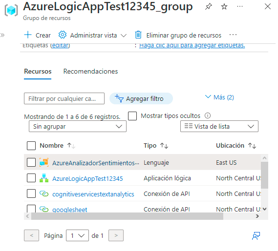
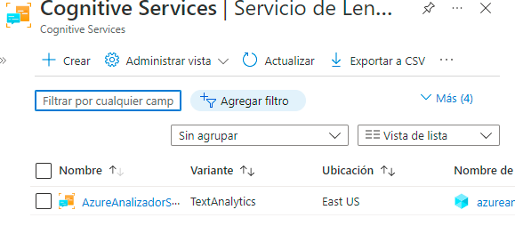
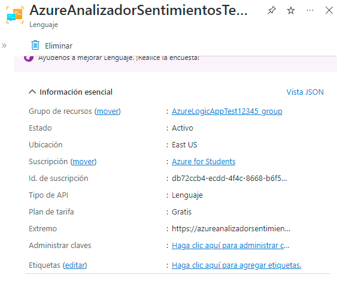
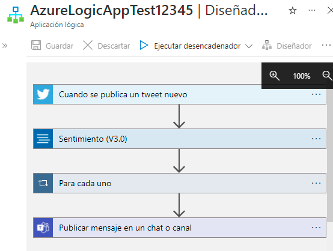

# Practica4Sesion4

1. Generar grupo de recursos para servicio Logic App Services.

2. Crear recurso de analizador de sentimientos en Cognitive Services.
3. Generar diagrama de procesos para la aplicación logica conectando una cuenta de twitter y teams.

4. Durante cada sección de la aplicación se le deben asignar parametros que se utilizaran para el proceso del API.
5. La aplicación en este caso detecta todos los tweets que inclutan el #IAWizards y se programa para que reciba los parametros del texto, usuario y fecha, datos que dee recibir un excel en Google Drive , mismo que se programa durante el diagrama de flujo y finalemente estos datos los enviara en forma de aviso al grupo de teams conectado.

#
Autor: Rogelio Clemente Balderas
-

Requisitos:
-
- Azure Logic Apps Services
- Recurso de Cognitive Services lenguaje analizador de sentimientos
- Cuenta de Twitter
- Cuenta Google Drive
#